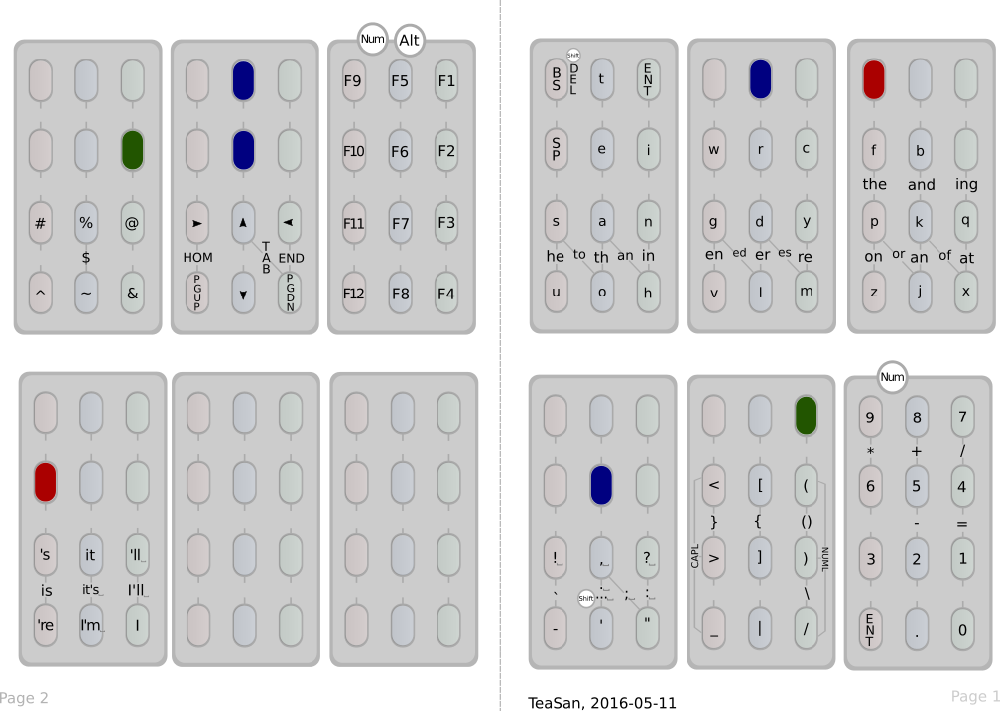

# twiddler-configs and cheat sheets

This repo holds my [Twiddler3](http://twiddler.tekgear.com/) keyboard
config file as well as cheat sheets for some different Twiddler3 key
configs listed below. Each is exemplified by the first block from
their cheat sheet. Hope the sheets are useful to someone!

## Default

This is the default keyboard layout coming with the Twiddler since 20
years or so.  Its letters are ordered alphabetically which makes it
pretty easy to learn while maybe being less than optimal for
touch-typing (but then again, neither is querty). It is widely used.

## TabSpace

This custom layout was made by Brandon Rhodes in 1999 and changes the
default in many ways. Notably it optimizes the letter distribution for
how often they are used in English. It centers around using the index
finger as a common qualifier and moves the TAB key to make the layout
more useful for a programmer/terminal user. This is a popular
alternative, even linked to from the Twiddler documentation.  Brandon
discusses the layout and its ideas at length 
[in this PDF](http://rhodesmill.org/brandon/projects/tabspace-guide.pdf).

## BackSpice

User Alex Bravo started from TabSpace some years ago and made his own
modifications until the two shared little resemblance. He apparently
uses backspice every day to good results. The cheat sheet is for the
"full" backspice layout rather than the "simplified" one without the
N-grams. You can get the latest backspice config and read more
information 
[at his github reposity](https://github.com/AlexBravo/Twiddler). Note
that there may still be changes happening to the config, at which
point this sheet may not be completely accurate. 

## DelEnt / TeaSan

These were my first own keyboard layouts. They were made by starting from
an empty key layout (so *not* from TabSpace or Default) and ordering the
letters by frequency. From the original DelEnt I soon moved on to TeaSan
which reshuffled the letters futher to subjectively fit what felt best
for my hand. I also found that DelEnt was too heavy on my pinky, so this
moved i and n up a bit. I also removed a lot of N-grams and clustered them
more logically.  

## MirrorWalk

This is my current layout, based on the impressive "walking" layout 
described by [Bill Horner](https://github.com/ben-horner/twiddler_layout/). This
works very differently from the ones above. Notably every chord
involves at least two fingers. There are *no* single-finger chords.
The brilliance of this is that Mr. Horner calculated the transitions
*between* keys (finding a placement where he claims 65% of the included 
N-grams can be traversed in a "walk", where you either let the last key in 
one chord be the first key in the next, or where you can keep one finger fixed
why only moving the other. This requires a bit of extra gymnastics originally,
since you, to be most efficient need to consider the *next* chord you want to
reach in order to release/hold the right finger. The result is a very interesting
type of chording that only uses your strongest three fingers for all letters, leaving
the pinky to only handle special characters and punctuation. 

Bill Horner lays out the walking scheme in his repo but doesn't
include a full config. My "mirrorwalk" config takes his calculated
chord scheme and adds all the needed keys like return/backspace,
arrows etc in logical places. It also moves around the punctuation and
other keys in ways that makes the scheme more consistent to me. 

I have updated the mirrorwalk config with additional single-key letters
for handling some cross-situations when the walk fails between certain keys.
It's recommended to learn the walk with `mirrorwalk_nomcc` first and really
learn the walk since if you *can* do the walk it's faster than releasing
the finger to press the few single-finger chord letters available in my
latest version of mirrorwalk. 

## Cheat-sheet template

This is an empty SVG template I start from when planning out a new
layout. It's quite nice for making/presenting your own Twiddler config
in a nice way. It's meant to be printed and folded once or twice so
you can to carry it with you for easy reference.

The template and all cheat-sheets were created in the OSS program
[Inkscape](https://inkscape.org/en/). The sheets are in color but the
colors are chosen such that they will present very clearly also in
black&white. Use as you please!

The PDFs I made are ISO A4 format. If you prefer another paper format,
you can always change the document type of the corresponding SVGs in
Inkscape and print that.
