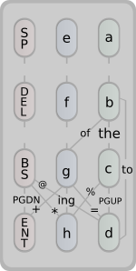
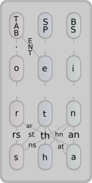
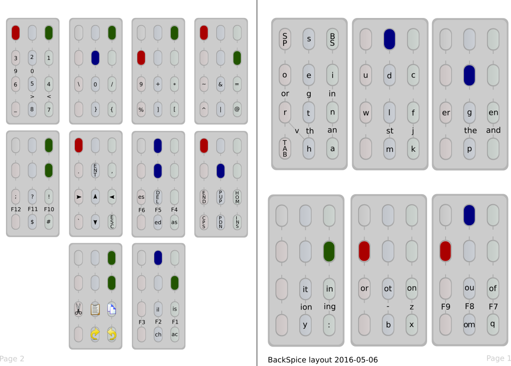
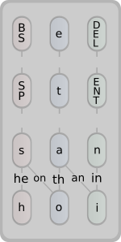

# twiddler-configs and cheat sheets

This repo holds my [Twiddler3](http://twiddler.tekgear.com/) keyboard
config file as well as cheat sheets for some different Twiddler3 key
configs listed below. Each is exemplified by the first block from
their cheat sheet. Hope the sheets are useful to someone!

## Default

This is the default keyboard layout coming with the Twiddler since 20
years or so.  Its letters are ordered alphabetically which makes it
pretty easy to learn while maybe being less than optimal for quick
keyboard input - it's works fine though, and there are some
interesting tricks in there. 

## TabSpace

This custom layout was made by Brandon Rhodes in 1999 and changes the
default in many ways. Notably it optimizes the letter distribution and
to make it more useful for a programmer/terminal user. This is a
popular alternative, even linked to from the Twiddler documentation.
Brandon discusses the layout and its ideas at length 
[in this PDF](http://rhodesmill.org/brandon/projects/tabspace-guide.pdf).

## BackSpice

User Alex Bravo started from TabSpace some years ago and made his own
modifications until the two shared little resemblance. He apparently
uses backspice every day to good results. The cheat sheet is for the
"full" backspice layout rather than the "simplified" one without the
N-grams. You can get the latest backspice config and read more
information 
[at his github reposity](https://github.com/AlexBravo/Twiddler). Note
that there may still be changes happening to the config, at which
point this sheet may not be completely accurate. 

## DelEnt

This is my personal keyboard layout, named after the Del and Ent keys
being next to each other (had to pick something ...). I made this by
reshuffling the letters of the default config by order of frequency in
English (so *not* from TabSpace). The config then grew from there.

While I'm both a Unix user and a programmer, my main use of the
Twiddler is for writing text when on the move (usually "blindly", with
the phone tucked away in a pocket). So this layout does not have much
focus on programming/terminal use - contrary to the other layouts the
Tab key is pretty well tucked away, for example. 

I also have rather short fingers which influenced where various common
keys ended up and which types of finger-combinations are allowed. This 
tended to make for a pretty clean presentation which helps me remember
it visually. Nevertheless it's of course a work in progress.

## Cheat-sheet template

I put up the empty SVG template for making/presenting your own
Twiddler config in a nice way. It's meant to be printed and folded
once or twice so you can to carry it with you for easy reference.

The template and all cheat-sheets were created in the OSS program
[Inkscape](https://inkscape.org/en/). The sheets are in color but the
colors are chosen such that they will present very clearly also in
black&white. 

Released under BSD so use as you like. The PDFs I made are ISO A4
format. If you prefer another paper format, you can always change the
document type of the corresponding SVGs in Inkscape and print that.
